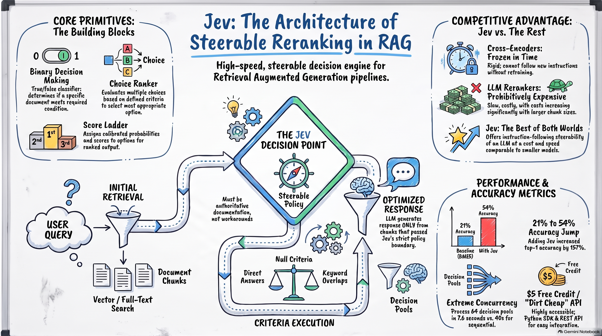

# I Built a RAG Pipeline Where the Reranker Decides Everything — And It Cut My LLM Bill by Half

*How I used Jev — TypeSafe AI's calibrated decision engine — not just as a reranker, but as the decision layer of an entire RAG pipeline: deciding whether to retrieve, which chunks are good enough, and whether the answer's citations actually hold up. With real benchmarks against five pipeline variants.*

---

## The Problem: Your RAG Pipeline Is Making Decisions It Can't Defend

Every RAG pipeline makes three implicit decisions on every single query:

1. **Should I even answer this?** Most pipelines skip this entirely and retrieve anyway.
2. **Which retrieved chunks are actually good enough?** Retrievers return `k` chunks whether or not any of them are relevant — a guarantee of *quantity*, not *quality*.
3. **Can I trust what the LLM just said?** Almost nobody checks.

We accept this because the alternatives felt worse. Cross-encoder rerankers (BGE, ColBERT, Cohere) are fast but **frozen in time** — their notion of relevance is baked into weights at training time, and you can't steer them with a plain-English policy like "must be authoritative documentation, not workarounds." Prepending policy text to the query just causes keyword collision that promotes exactly the documents the policy meant to exclude. LLM-as-reranker works beautifully but is **prohibitively expensive** — cost and latency scale with every token you ask it to read and generate.



*Jev's pitch: the instruction-following steerability of an LLM at a cost and speed comparable to smaller models. Three typed primitives — Noul (binary), Choice (routing), Score (ordinal ladder) — each returning calibrated probabilities.*

The published numbers are hard to ignore: adding Jev as a reranker on top of BM25 moved top-1 accuracy from **21% to 54%** (a 157% jump), and Jev's 64-way concurrency processed decision pools in **7.6 seconds vs ~40 seconds** sequential.

But a marketing one-pager isn't an architecture. So I built the whole thing — a real, end-to-end hybrid RAG pipeline over real PDFs — and measured what Jev actually buys you when it sits at *every* decision point, not just the reranking one. This post is that build, with numbers.

---

## The Core Idea: Jev as a Decision Layer, Not Just a Reranker

Jev (from TypeSafe AI, via the `typesafe-sdk` Python package) is a **calibrated decision engine**. You hand it a state and one or more questions; each question is a typed primitive with explicit criteria written in plain English; it returns a probability distribution — not free text you have to parse, not a single unexplained score.

Three primitives cover essentially every branch point in a pipeline:

| Primitive | Shape | Returns | RAG job it does |
|---|---|---|---|
| **`Noul`** | Binary (true/false) | `P(criterion holds)` | "Does this chunk *directly answer* the question?" / "Is this claim supported by this passage?" |
| **`Choice`** | Categorical | Probability per label | Pre-retrieval routing: `in_scope` / `out_of_scope` / `unsafe` |
| **`Score`** | Ordinal 0–4 rubric ladder | Expected score, confidence, full per-level distribution | Relevance ranking *plus* a calibrated gate |

That last column is the thesis of this post. The same machinery, asked three different questions, becomes the **decision layer** of the pipeline:

```
START -> guardrail --(P(in_scope) < threshold)--> abstain -> END
             |
             v
         retrieve -> rerank_gate --(no chunk >= MIN_RELEVANCE)--> abstain -> END
                          |
                          v
                      generate -> verify (citation check) -> END
```

The LLM is called **once**, and only after Jev has decided there is something worth answering from. Every edge in this LangGraph is driven by a calibrated probability, which is what makes fixed thresholds meaningful across queries.

---

## The Build: A Real Hybrid RAG Pipeline Over Real PDFs

I wanted zero hand-waving, so the pipeline runs over two real PDFs — including one with six embedded diagrams that exercise an actual multimodal ingestion path. Conveniently, both documents explain Jev itself, so the decision layer gets evaluated on documents *about the exact technique it implements*.

**The stack:**

| Component | Choice |
|---|---|
| Document processing | PyMuPDF (text) + Claude Sonnet vision captioning (embedded images) |
| Chunking | LangChain `RecursiveCharacterTextSplitter` (700 chars, 100 overlap) |
| Vector store | Chroma, local persistence |
| Embeddings | Local `BAAI/bge-small-en-v1.5` — no API key needed |
| Sparse retriever | BM25 (`rank_bm25`), k=8, weight 0.4 |
| Dense retriever | Vector search, k=8, weight 0.6 |
| Hybrid fusion | LangChain `EnsembleRetriever` (reciprocal-rank fusion) |
| Decision layer | Jev `Noul` / `Score` / `Choice` via `typesafe-sdk` |
| Orchestration | LangGraph `StateGraph` with Jev-driven conditional edges |
| Synthesis + judges + vision | Claude Sonnet via OpenRouter's OpenAI-compatible API |

The ingestion detail worth stealing: for the diagram-heavy PDF, I extracted every embedded raster with PyMuPDF, filtered out icons/logos with a minimum-pixel threshold, and sent each surviving image to Claude's vision model for a 2–3 sentence caption. Each caption becomes its own atomic chunk tagged `content_type="image_caption"` — which makes a diagram's content retrievable by a text query even though the diagram has no text layer. Text pages split into 47 chunks; the 5 captions passed through unsplit. Total: 52 chunks.

### The reranker: criteria as instructions, not weights

The heart of it is a five-level `Score` rubric:

```python
RELEVANCE_LADDER = Score(
    instructions=(
        "Rate how useful this candidate passage is for answering the user question. "
        "Judge direct topical relevance, whether the passage contains answer-bearing "
        "facts, and whether it helps answer the specific question rather than merely "
        "sharing words."
    ),
    criteria=[
        "Completely irrelevant or unrelated",
        "Slightly related but not useful for answering the question",
        "Moderately relevant and may provide supporting context",
        "Highly relevant and contains useful answer-bearing information",
        "Directly answers the question with specific supporting information",
    ],
)
```

For each candidate chunk, Jev returns three things a point-estimate reranker never gives you:

- **`score`** — the *expected* level, a probability-weighted average, so 2.7 is meaningful
- **`confidence`** — flag low-confidence ratings for review instead of trusting them
- **`probabilities`** — the full distribution over the five levels

That distribution matters. A chunk scored 2.0 because it's *split* between "irrelevant" and "directly answers" is a completely different signal from a chunk scored 2.0 because Jev is *confident* it's "supporting context." Two habits from the Jev-RAG reference implementation close the loop: **structured state** (Jev reads named fields — `user_question`, `candidate_passage`, `candidate_source` — so provenance travels with the chunk) and **deterministic tiebreaks** (sort by score, then confidence, then original retrieval rank).

Two production rules deserve explicit mention:

- **Degrade, don't die.** A failed Jev call scores 0.0 and sinks to the bottom of the ranking instead of killing the request. The SDK's `RetryPolicy` handles 408/429/5xx with backoff; the application never falls over because one evaluation timed out.
- **Calibration is what makes the gate work.** Retrieval always returns `k` chunks. Because Jev's scores are calibrated, one fixed threshold — `MIN_RELEVANCE_SCORE = 2.0` — means the same thing across every query. Ask "What is the capital of Australia?" against a Jev knowledge base and hybrid retrieval dutifully returns 8 chunks; every one scores 0.00 with confidence 1.00; the gate drops all of them and the pipeline **abstains** instead of padding the prompt with near-misses. That is the classic setup for a confident, plausible, unsupported answer — and the decision layer refuses to walk into it.

### Guardrail before retrieval, citation check after generation

`Choice` routes every incoming question before retrieval: `in_scope` / `out_of_scope` / `unsafe`, decided by calibrated `P(in_scope)` against a tunable threshold (0.35 here) rather than the argmax label — a knob for how cautious the gate is. If Jev itself is unreachable, the guardrail **fails open** to retrieval; flip that for a safety-critical deployment.

After generation, a `Noul` check verifies citations rather than just counting them: split the answer into claims, keep the cited ones, and for each (claim, passage) pair ask *"is this claim fully supported by this passage?"* A claim citing several passages counts as supported if any of them holds. The whole check costs a few Jev calls and **zero** LLM calls — a cheap, claim-level faithfulness signal.

---

## The Benchmark: Five Pipelines, Ten Questions, No Cherry-Picking

Every question runs through **five** pipelines that share the same retrieval and synthesis stages, so each comparison swaps exactly one thing:

| Pipeline | What it is |
|---|---|
| `hybrid_no_jev` | Hybrid retrieval → all 8 candidates straight to the LLM |
| `hybrid_with_jev` | Hybrid → Jev `Noul` rerank → top-3 to the LLM |
| `hybrid_llm_rerank` | Hybrid → **Claude scores each chunk with the identical rubric** → gated top-k |
| `full_context_no_rag` | No retrieval — the entire 21-document corpus in the prompt |
| `jev_decision_layer` | `Choice` guardrail → hybrid → `Score` rerank + gate → LLM → `Noul` citation check |

The eval set: 8 in-scope questions, each grounded in a checkable gold fact from the corpus, plus 2 out-of-scope probes ("What is the capital of Australia?" and a prompt-injection attempt) whose correct answer is a refusal. Every answer gets three grades: **faithfulness** (Claude judge: is the answer supported by its context?), **correctness** (Claude judge: does it match the gold fact?), and **citation support** (Jev: do cited passages back the claims?).

### Results: in-scope questions (means over 8)

| Metric | Hybrid, no rerank | + Jev Noul | + Claude rerank | Full context | **Jev decision layer** |
|---|---|---|---|---|---|
| Docs sent to LLM | 8.0 | 3.0 | 2.1 | 21.0 | **2.3** |
| Claude tokens / query | 1,554 | 695 | 3,758 | 6,900 | **594** |
| Cost / query | $0.00618 | $0.00360 | $0.01794 | $0.02236 | **$0.00328** |
| Total latency | **3,841 ms** | 4,099 ms | 7,808 ms | 6,046 ms | 4,841 ms |
| Faithfulness (LLM judge) | 0.91 | 1.00 | 1.00 | 1.00 | **1.00** |
| Correctness vs. gold | 0.63 | 0.63 | 0.69 | **0.75** | 0.69 |
| Jev citation support | 0.76 | 0.74 | 0.89 | 0.87 | 0.83 |

The headline: **the decision layer is the cheapest pipeline at $0.0033/query — roughly half the no-rerank baseline and 5.5x cheaper than using Claude as the reranker — while shipping 100% judge-measured faithfulness and cutting Claude tokens by ~62% versus no reranking.**

### Rerank stage, head-to-head: Jev vs. Claude doing the same job

Same candidates, same 0–4 rubric, same gate. This is the fair comparison — the other way people actually rerank today:

| Reranker | Latency | Cost | Kept-set agreement |
|---|---|---|---|
| Jev Score ladder | 512 ms | $0.00019 | — |
| Claude as reranker | 4,076 ms | $0.01533 | 1/1 (Spearman ρ = 0.87) |

**87% faster and ~99% cheaper, with the same ranking outcome.** For reference, the independent benchmark table in the source material lines up directionally — Jev vs. Cohere Rerank 3.5, Amazon Rerank 1.0, and Claude Haiku 4.5:

| Method | Recall@1 | nDCG@5 | Speed | Cost / 1,000 queries |
|---|---|---|---|---|
| No reranking | 0.800 | 0.814 | — | — |
| Cohere Rerank 3.5 | 0.950 | 0.884 | 198 ms | $2.00 |
| Amazon Rerank 1.0 | 0.850 | 0.819 | 337 ms | $1.00 |
| Claude Haiku 4.5 | 1.000 | 0.960 | 981 ms | $2.73 |
| **Jev** | **0.983** | **0.965** | **290 ms** | **$0.25** |

And on threshold calibration — where a false block is as bad as a miss — Jev posted **99.2% accuracy with a 0.0% near-miss rate** versus Cohere's 65.0% and Amazon's 65.8%.

### The out-of-scope probes: what "no" costs

All five pipelines declined both probes correctly. The interesting number is the price of declining:

| Pipeline | Mean latency | Mean cost | LLM synthesis calls |
|---|---|---|---|
| hybrid_no_jev | 3,753 ms | $0.00501 | 2 |
| hybrid_with_jev | 6,146 ms | $0.00286 | 2 |
| hybrid_llm_rerank | 6,525 ms | $0.01377 | 0 |
| full_context_no_rag | 4,731 ms | $0.02133 | 2 |
| **jev_decision_layer** | **455 ms** | **$0.00002** | **0** |

The guardrail refuses *before retrieval*, so the prompt-injection attempt never reaches an LLM at all. **100x cheaper than the next best option, and roughly 8x faster.** At scale, the traffic you don't serve is the cheapest traffic there is.

One more number for the economics: the *entire notebook run* — every guardrail, rerank, gate, and citation check across all pipelines and all questions — made 565 Jev calls over 306K input tokens for **$0.0129**. Jev's real payoff is upstream, in the Claude tokens it lets you not spend.

---

## The Honest Tradeoffs

A benchmark that only reports wins is marketing. Here's what the numbers actually said:

**1. The decision layer is the cheapest pipeline, but not the fastest on in-scope questions.** Its three Jev stages (~340 ms guardrail + ~510 ms rerank + ~370 ms verify ≈ 1.2 s) run sequentially around a single generation call, and they cost more time than the smaller prompt saves in generation. Plain hybrid-with-Jev-rerank was faster. If latency is your binding constraint, the citation check can move off the request path into logging; if cost or safety is, the layers earn their keep.

**2. Correctness sat at 0.63–0.69 for every RAG variant; full context won at 0.75.** No reranker can rescue a chunk that retrieval never found — **retrieval recall is the ceiling on end-to-end quality**, and a decision layer can only reorder and filter what it's given. When the gate was strict (`MIN_RELEVANCE_SCORE = 2.0` often kept exactly one chunk), it traded correctness for caution. Tune the gate against the correctness chart, not the faithfulness one — a system that abstains on everything is perfectly faithful and perfectly useless.

**3. Numbers move between runs.** LLM sampling and API latency jitter mean a few hundred milliseconds or one question's worth of correctness (≈0.06) is noise. Treat the direction as the result, not the third decimal.

**4. The cheap citation check and the expensive judge see different things.** On an easy corpus the whole-answer LLM judge saturates at 1.0 while the claim-level Jev check still separates answers (it flagged real over-reach the judge glossed over). Read the lowest-scoring claims before trusting either signal alone.

---

## The Takeaway

Reranking was never really the point. The point is that **calibrated, instruction-following decisions are now cheap enough to sit at every branch point of a pipeline** — and that changes what a RAG system is. Not a retrieval hose pointed at an LLM, but a policy engine that retrieves, filters, abstains, and verifies, with the LLM as one well-guarded stage inside it.

- **Calibrated probabilities are the enabler.** Fixed thresholds only work if a score means the same thing on every query. That's what turned three small decisions into an architecture.
- **The right baseline is the LLM-as-reranker, not "no reranker."** Against that real alternative, Jev did the identical rubric job 87% faster and ~99% cheaper.
- **The biggest wins are the calls you never make.** Zero-LLM refusals at $0.00002 and 62% fewer synthesis tokens matter more at scale than any single ranking improvement.

If you want to reproduce or extend this, the full notebook is self-contained: swap in your PDFs, update the guardrail's description of your knowledge base, raise `HYBRID_TOP_K`/`JEV_TOP_K` with your corpus size, and extend the eval set with gold facts from your own material. Every concept lives in its own cell, so each piece can be read, run, and modified in isolation.

---

*Stack: LangChain + LangGraph, Chroma, BM25 + bge-small embeddings, Claude Sonnet via OpenRouter, Jev via `typesafe-sdk`. All costs at list pricing; OpenRouter may add a small markup. Benchmark figures for third-party rerankers are as reported in the source material and worth re-verifying on your own data before you bet a production budget on them.*
